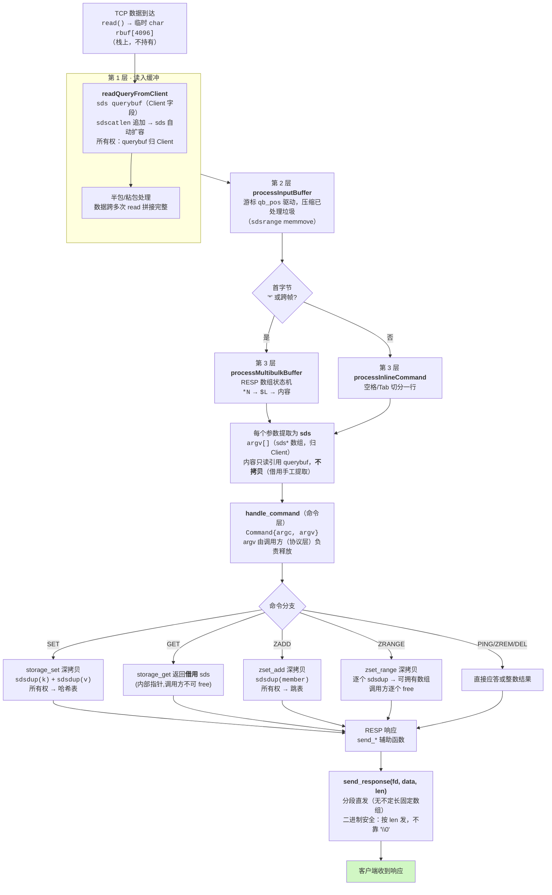
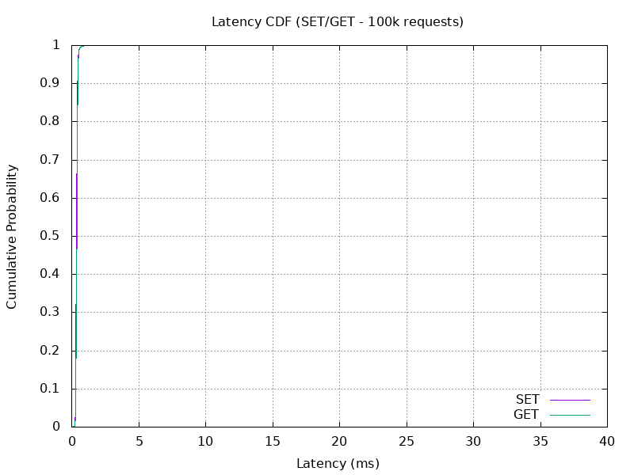

# mini-redis

用纯 C 语言手写的、兼容 Redis 协议的、内存级键值存储引擎。

从 Socket 网络编程、RESP 协议解析，到哈希表、跳表、有序集合与 **SDS（简单动态字符串）**，全部手写，不依赖任何第三方库 —— 证明自己「能写底层」的最强证据。

## 🚀 快速开始

### 编译

```bash
make clean && make
```

### 运行服务器

```bash
./mini-redis
```

> 自定义端口（按优先级：命令行参数 > `PORT` 环境变量 > 默认 6379）：
> ```bash
> ./mini-redis 6390          # 命令行参数指定端口
> PORT=6390 ./mini-redis     # 环境变量指定端口
> ```

### 用 redis-cli 连接测试

```text
redis-cli -h 127.0.0.1 -p 6379
127.0.0.1:6379> SET name zhangsan
OK
127.0.0.1:6379> GET name
"zhangsan"
127.0.0.1:6379> DEL name
(integer) 1

127.0.0.1:6379> ZADD myzset 10 apple
OK
127.0.0.1:6379> ZADD myzset 5 banana
OK
127.0.0.1:6379> ZRANGE myzset 0 -1
1) "banana"
2) "apple"
127.0.0.1:6379> ZSCORE myzset apple
"10"
127.0.0.1:6379> ZREM myzset banana
(integer) 1
```

### 跑全量回归测试

```bash
./test.sh        # 40 个用例，全部通过
```

## 🏗️ 项目架构

```
mini-redis/
├── include/
│   ├── protocol.h    # 协议解析接口
│   ├── storage.h     # 存储层接口
│   ├── hashtable.h   # 哈希表接口
│   ├── skiplist.h    # 跳表接口
│   ├── zset.h        # 有序集合接口
│   ├── commands.h    # 命令分发接口
│   └── sds.h         # 简单动态字符串接口（二进制安全 + 自动扩容）
├── src/
│   ├── server.c      # 服务器主程序（Socket + 请求生命周期 + RESP 发送层）
│   ├── protocol.c    # RESP 协议解析器
│   ├── commands.c    # 命令分发（PING/SET/GET/DEL/ZADD/ZREM/ZSCORE/ZRANGE）
│   ├── storage.c     # 存储层（封装哈希表，深拷贝边界）
│   ├── hashtable.c   # 哈希表实现（djb2 + 链地址法 + 自动扩容）
│   ├── skiplist.c    # 跳表实现
│   ├── zset.c        # 有序集合（封装跳表，深拷贝边界）
│   ├── sds.c         # SDS 实现（5 档 header + 二进制安全 + 预分配扩容）
│   ├── test_resize.c # 哈希表扩容测试
│   ├── test_skiplist.c # 跳表功能测试
│   └── test_zset.c   # 有序集合测试
├── test.sh           # 自动化回归测试脚本（40 用例，支持 HOST/PORT/SKIP_BUILD 覆盖）
├── bench/            # 压测与探针脚本合集
│   ├── bench.sh         # redis-benchmark 多命令/多并发/多数据量压测
│   ├── bench_py.py      # 流水线吞吐 + 延迟分布快测
│   ├── bench_collect.py # 多流水线深度/多命令/多负载 QPS → CSV
│   ├── bench_focus.py   # 聚焦压测（固定流水线深度 SET/GET/大值 QPS，sds vs 无sds 对比）
│   ├── bench_ping_curve.py # PING 流水线深度缩放曲线
│   ├── bench_latency.py   # 延迟分布（多档位大值 SET/GET 的 min/avg/p50/p99，sds vs 无sds）
│   ├── bench_throughput.py # 大数据吞吐（多档位大值 SET/GET 的流水线 QPS + MB/s 载荷吞吐）
│   └── correctness_probe.py # 二进制安全 / 大值正确性探针
├── Makefile
└── README.md
```

### 架构分层

```text
┌─────────────────────────────────────────────┐
│  网络层 (server.c)  readQueryFromClient       │  ← Socket 通信、事件循环、请求生命周期
├─────────────────────────────────────────────┤
│  协议层 (protocol.c / server.c)               │  ← RESP 解析（multibulk + inline 状态机）
├─────────────────────────────────────────────┤
│  命令层 (commands.c)  handle_command          │  ← PING/SET/GET/DEL/ZADD/ZREM/ZSCORE/ZRANGE
├─────────────────────────────────────────────┤
│  存储层 (storage.c / zset.c)                  │  ← 封装哈希表与有序集合，深拷贝边界
├─────────────────────────────────────────────┤
│  数据结构层 (hashtable / skiplist / sds)      │  ← djb2 哈希 / 跳表 / 简单动态字符串
└─────────────────────────────────────────────┘
```

## 🔄 请求生命周期：从进来到最后发出去

这是**一条命令从到达服务器到把响应发回客户端**的完整数据流动，标注了每层的函数、数据类型和数据所有权变化。



**所有权速查表**

| 数据 | 生命周期 | 谁负责释放 |
|------|---------|-----------|
| `rbuf[4096]` | 单次 read 后即弃 | 栈（无需释放） |
| `querybuf` (sds) | 整个连接期间 | `free_client` → `sdsfree` |
| `argv[]`（协议层提取的 sds） | 单条命令后释放 | `processMultibulkBuffer` / `processInlineCommand` |
| 哈希表 key/value | 存入即归哈希表 | `hashtable_free` / `hashtable_del` |
| 跳表 member | 存入即归跳表 | `skiplist_free` / `skiplist_del` |
| `zset_range` 返回数组 | 调用方使用完毕后 | 命令层逐个 `sdsfree` + `free` |
| `storage_get` 返回值 | 借用（只读） | **不要** free |

## 🧵 SDS：简单动态字符串

SDS 是这套引擎的数据基石 —— 协议解析、缓冲管理、底层存储全部用它。它解决了裸 C 字符串的 5 个缺陷：

1. **取长度 O(1)**：header 里存了 `len`，不用 `strlen` 从头扫。
2. **二进制安全**：按 `len` 处理数据，数据里含 `\0` 也不会被切断。
3. **防缓冲区溢出**：拼接前检查容量，自动扩容，杜绝 `strcpy/strcat` 越界。
4. **避免频繁重分配**：`sdsMakeRoomFor` 预分配（<1MB 翻倍 +1，≥1MB +1MB）。
5. **自描述**：`len/alloc/flags` 都在 header 里，字符串知道自己多大。

### 5 档 header（根据长度选最小档）

| 类型 | flags 编码 | 覆盖长度 | header 大小 |
|------|-----------|---------|------------|
| `SDS_TYPE_5` | 高 5 位存 len | 0–31 字节 | 1 字节 |
| `SDS_TYPE_8` | `uint8` | 0–255 | 3 字节 |
| `SDS_TYPE_16` | `uint16` | 0–64K | 5 字节 |
| `SDS_TYPE_32` | `uint32` | 0–4G | 9 字节 |
| `SDS_TYPE_64` | `uint64` | 超大 | 17 字节 |

`char *s` 指向数据区起点，前面紧贴一个 `sdshdr`。`sdslen()` 通过 `s[-1]` 反向回溯 header 读 `len`，O(1)。

> ⚠️ **踩过的坑（已修复）**：`SDS_TYPE_5` 用 `len << 3` 存在 `s[-1]` 里。当 `len ∈ [16,31]` 时 `len << 3 ≥ 0x80`，作为 **有符号 char** 是负数，`s[-1] >> 3` 算术右移会变成巨大 `size_t`（如 `0xFFFFFFFFFFFFFFF0`），导致 `sdsdup`/`sdsnewlen` 拷贝巨大长度 → 缓冲区溢出崩溃。修复：右移前先 `(unsigned char)` 强转。

## ✅ 全量测试

`./test.sh` 共 **40 个用例**，覆盖：

| 分组 | 覆盖点 |
|------|--------|
| 基础命令 | PING / SET / GET / DEL 正常路径 |
| 有序集合 | ZADD / ZREM / ZSCORE / ZRANGE、反序、重复 member 更新分数 |
| 边界与异常 | 未知命令、参数个数错误、非法 score（NaN/垃圾）、非法索引、ZADD 同分 |
| 协议解析 | multibulk / inline、空行忽略、粘包与**半包分帧**（header 分段、bulk 内容分段） |
| 二进制安全 | 含 `\0` 的值、二进制 zset member |
| 超大值 | 2000B / 8192B / 320KB 值（验证 sds 动态扩容 + 无固定缓冲限制） |

**结果：40/40 全部通过 ✅**

## 📊 压测与 SDS vs 无 SDS 对比

> **四把尺子怎么读**：① **正确性**（能不能存、存了会不会丢/崩）——决定「能不能用」；② **吞吐 QPS**（流水线，单位时间处理多少命令）——决定「快不快」；③ **大数据吞吐 MB/s**（流水线，单位时间读写多少字节）——决定「大值场景扛不扛得住」；④ **延迟 µs**（串行，单次操作真实耗时）——决定「响应手感」。四个维度对齐看，就是最后「什么场景该用谁」的依据。

### 测试环境与基线

- CPU：VMware 虚拟机｜内存：2GB｜OS：RHEL 8.10｜编译器：gcc 8.x
- **对比基线**：无 SDS 版本（提交 `393ced1`，改造前）用固定 `char querybuf[1024]` + 裸 C 字符串（`malloc(len+1)` + `strcpy`，遇 `\0` 截断，固定容量上限）。SDS 版即当前 `master`。
- 复现：`bench/correctness_probe.py`、`bench/bench_focus.py`、`bench/bench_throughput.py`、`bench/bench_latency.py`

---

### 1. 正确性：能不能用（二进制安全 + 大值）

| 测试项 | SDS 版 | 无 SDS 版 |
|--------|--------|----------|
| 含 `\0` 的值（`A\x00xy`） | ✅ 原样存取 | ❌ 截断成 `A`（strcpy 遇 `\0` 停） |
| 16 字节 key（TYPE_5 边界）、32B key | ✅ | ✅ |
| 2000B / 64KB / 320KB 值 | ✅ 任意大小 | 💥 崩溃（>1KB 固定缓冲溢出） |
| 二进制 zset member | ✅ | —（崩溃前未测到） |

> **结论**：正确性是 SDS 的胜负手——二进制安全（`\0` 不截断）+ 无固定容量上限。无 SDS 在 >1KB 的值上直接缓冲区溢出崩溃。

---

### 2. 小命令吞吐（流水线 depth=200，QPS）

| 操作 | SDS 版 | 无 SDS 版 | 说明 |
|------|--------|----------|------|
| SET | 54,674 | 136,534 | 无 SDS 快约 **2.5x** |
| GET | 55,477 | 166,999 | 无 SDS 快约 **3x** |

```dsh-ui
{"title":"小命令吞吐 · 无SDS 更快 (depth=200, QPS)","gap":12,"items":[{"type":"chart","kind":"bars","data":[{"label":"无SDS GET","value":166999},{"label":"无SDS SET","value":136534},{"label":"SDS GET","value":55477},{"label":"SDS SET","value":54674}],"horizontal":true},{"type":"callout","tone":"info","title":"为什么小命令下无 SDS 反而更快？","content":"无 SDS 用固定栈缓冲 + 直接 memcpy，零动态分配；SDS 每次命令有 header 校验 + sdsMakeRoomFor 预分配等动态分配开销。服务器本身是 IO 瓶颈，无 SDS 省掉了命令构造开销，所以小命令快 2-3 倍。但这份速度换来的是无法处理 >1KB 值、无法存取含 \\0 的二进制数据。"}]}
```

---

### 3. 大数据吞吐（新增，流水线 depth=200，QPS + 载荷 MB/s）

> 这是「单位时间能读写多少**字节**」——对 SET 是写入值字节，对 GET 是读出值字节（= QPS × 值大小）。无 SDS 在 512B 后（≥1KB）因固定缓冲溢出崩溃，故只有 512B 一档；SDS 全档位存活。

| 值大小 | SDS SET QPS (MB/s) | SDS GET QPS (MB/s) | 无SDS SET QPS (MB/s) | 无SDS GET QPS (MB/s) |
|--------|-------------------|-------------------|----------------------|----------------------|
| 512B | 80,108 (**39**) | 87,532 (**43**) | **159,077** (**78**) | **177,609** (**87**) |
| 1KB | 70,429 (69) | 68,919 (67) | 💥 崩溃 | 💥 崩溃 |
| 4KB | 61,950 (242) | 68,993 (269) | 💥 崩溃 | 💥 崩溃 |
| 32KB | 33,548 (1,048) | 17,417 (544) | 💥 崩溃 | 💥 崩溃 |
| 128KB | 13,395 (1,674) | 3,127 (391) | 💥 崩溃 | 💥 崩溃 |

```dsh-ui
{"title":"大数据吞吐 · 仅 SDS 存活 (depth=200, 载荷 MB/s)","gap":12,"items":[{"type":"chart","kind":"line","series":[{"label":"SDS SET (写入)", "data":[{"label":"512B","value":39},{"label":"1KB","value":69},{"label":"4KB","value":242},{"label":"32KB","value":1048},{"label":"128KB","value":1674}]},{"label":"SDS GET (读出)", "data":[{"label":"512B","value":43},{"label":"1KB","value":67},{"label":"4KB","value":269},{"label":"32KB","value":544},{"label":"128KB","value":391}]}]},{"type":"callout","tone":"error","title":"512B 后无 SDS 直接崩","content":"无 SDS 只有 512B 一档（SET 78 / GET 87 MB/s，还比 SDS 快约 2 倍）；从 1KB 起因固定 1024 字节缓冲溢出而崩溃。SDS 的写吞吐随值变大一路冲到 128KB 的 1674 MB/s —— 单线程 IO 被榨满，这就是 SDS 在大值吞吐上的能力边界。"}]}
```

> **读它**：小值（512B）时无 SDS 的载荷吞吐是 SDS 的 ~2 倍；但一旦值 ≥1KB，无 SDS 直接崩，SDS 仍能以 39→1674 MB/s 的坡度持续扩容。**大值吞吐是 SDS 的专属战场**。

---

### 4. 延迟分档（串行 RTT，µs，N=3000）

> 发一条 → 等回复 → 再发下一条的**单命令真实延迟**（用户感知）。与第 2/3 节的流水线吞吐互补。

| 操作 · 档位 | SDS avg/p50/p99 | 无SDS avg/p50/p99 |
|------------|----------------|-------------------|
| SET 8B | 120 / 106 / 213 | **82 / 72 / 191** |
| GET 8B | 141 / 132 / 241 | **101 / 90 / 221** |
| SET 512B | 129 / 116 / 237 | **112 / 98 / 218** |
| GET 512B | 122 / 110 / 229 | **100 / 87 / 206** |
| SET 1KB / 4KB / 32KB | 121–134 / 109–121 / 221–237 | 💥 崩溃 |
| SET 128KB | 192 / 175 / 309 | 💥 崩溃 |
| GET 128KB | 225 / 218 / 339 | 💥 崩溃 |

```dsh-ui
{"title":"① 小命令延迟 (µs) · 无SDS 略低","gap":12,"items":[{"type":"chart","kind":"bars","data":[{"label":"GET 8B 无SDS","value":101},{"label":"GET 8B SDS","value":141},{"label":"SET 8B 无SDS","value":82},{"label":"SET 8B SDS","value":120},{"label":"GET 512B 无SDS","value":100},{"label":"GET 512B SDS","value":122},{"label":"SET 512B 无SDS","value":112},{"label":"SET 512B SDS","value":129}],"horizontal":true}]}
```

```dsh-ui
{"title":"② 大值延迟 · 只有 SDS 存活 (SET avg µs)","gap":12,"items":[{"type":"chart","kind":"line","series":[{"label":"SDS (全档位稳定)", "data":[{"label":"8B","value":120},{"label":"512B","value":129},{"label":"1KB","value":123},{"label":"4KB","value":121},{"label":"32KB","value":134},{"label":"128KB","value":192}]}]},{"type":"callout","tone":"error","title":"大值延迟上无 SDS 无数据","content":"小命令（≤512B）下无 SDS 延迟比 SDS 低约 10-30%（无动态分配）。但 1KB 起无 SDS 崩溃，SDS 延迟从 ~120µs 平滑升到 128KB 的 ~192µs，依旧稳定服务 —— 这就是 SDS 的延迟优势区。"}]}
```

> **怎么读**：小命令（≤512B）无 SDS 快 10%–30%；**≥1KB 无 SDS 崩溃，SDS 以 120µs→192µs 平滑续服务**。SDS 的延迟曲线在 4KB 前几乎平（~120µs），远没到瓶颈。

---

### 5. PING 流水线深度缩放（QPS vs 管道深度）

| 管道深度 | SDS 版 | 无 SDS 版 |
|---------|--------|----------|
| 1 | 7,579 | 10,422 |
| 10 | 33,896 | 59,609 |
| 50 | 54,519 | 117,547 |
| 200 | 61,126 | 175,638 |
| 500 | 61,763 | 153,960 |
| 1000 | 64,945 | 170,483 |

```dsh-ui
{"title":"PING 流水线深度缩放曲线","gap":12,"items":[{"type":"chart","kind":"line","series":[{"label":"无 SDS","data":[{"label":"1","value":10422},{"label":"10","value":59609},{"label":"50","value":117547},{"label":"200","value":175638},{"label":"500","value":153960},{"label":"1000","value":170483}]},{"label":"SDS","data":[{"label":"1","value":7579},{"label":"10","value":33896},{"label":"50","value":54519},{"label":"200","value":61126},{"label":"500","value":61763},{"label":"1000","value":64945}]}]}]}
```

> 两条曲线都随管道深度上升，无 SDS 上限显著更高（~17 万 vs ~6.5 万）。

---

### 6. 使用场景决策：什么时候该用无 SDS，什么时候该用 SDS？

```dsh-ui
{"title":"无 SDS vs SDS · 选型决策","gap":14,"items":[{"type":"table","columns":["维度","无 SDS","SDS"],"rows":[["小命令(≤512B) 吞吐","✅ 快 2-3 倍","O 约 1/3"],["大值(≥1KB) 吞吐/延迟","💥 崩溃","✅ 39→1674 MB/s"],["二进制安全(含 \\0)","❌ 截断","✅ 原样"],["防缓冲区溢出","❌ 固定 1024 易崩","✅ 自动扩容"],["单连接串行延迟","✅ 低 10-30%","O 略高"],["生产级健壮性","❌ 不可用","✅ 可用"]],"types":["text","text","text"]},{"type":"callout","tone":"success","title":"一句话选型","content":"只要你的值可能超过 1KB、或包含二进制数据（\\0）、或追求生产级健壮性——就用 SDS。只有当你确认数据永远是小而纯文本、且愿意承受固定缓冲崩溃风险去榨那 2-3 倍吞吐时，无 SDS 才有意义。绝大多数场景，SDS 的“稳而全”远超无 SDS 的“快而脆”。"}]}
```

| 你的场景 | 该用谁 | 原因 |
|---------|--------|------|
| 缓存/序列化数据（含 `\0`、二进制） | **SDS** | 无 SDS 遇 `\0` 截断丢数据 |
| 值可能 >1KB（图片、日志、大文档） | **SDS** | 无 SDS 固定 1024 缓冲溢出崩溃 |
| 纯文本小 KV，极致压 QPS | 无 SDS | 小命令快 2-3 倍 |
| 生产环境、要防崩溃 | **SDS** | 自动扩容 + 二进制安全 = 健壮 |
| 追求极低单命令延迟 | 无 SDS 略优 | 但仅限 ≤512B 才成立 |

---

### 7. 总结：SDS 到底提升了什么？

**SDS 没有让原始 QPS 变快，甚至略慢**，但它在**能力边界**上是质变：

```dsh-ui
{"title":"SDS 带来的真实提升","gap":12,"items":[{"type":"list","items":[{"title":"二进制安全","desc":"值/键/member 里可以含 \\0 字节。无 SDS 用 C 字符串遇 \\0 截断，会丢数据。对二进制协议/序列化数据是刚需。"},{"title":"无固定容量上限","desc":"querybuf 不再是写死的 char[1024]。1KB、64KB、320KB 的值都能存。无 SDS 在 >1KB 上缓冲区溢出直接崩溃。"},{"title":"大数据吞吐容量","desc":"128KB 值仍有 1674 MB/s 写入载荷吞吐；无 SDS 在 1KB 就崩。"},{"title":"O(1) 长度 + 自动扩容","desc":"header 存 len，取长不扫全串；sdsMakeRoomFor 预分配避免频繁 realloc，天然防缓冲区溢出。"},{"title":"代价：小命令略慢","desc":"动态分配 + header 处理让每个小命令多几条指令，原始小命令 QPS 约为无 SDS 的 1/3。"}]}]}
```

**一句话总结**：无 SDS 是「快但脆」—— 小命令快 3 倍、延迟低 30%，却扛不住 >1KB 的数据和含 `\0` 的二进制值；SDS 是「稳而全」—— 牺牲一点小命令速度，换来二进制安全 + 任意大小 + 大数据吞吐 + 防溢出，这才是生产级 KV 该有的样子。

## 📈 历史性能数据

> 以下为历次压测记录，保留以供参考（数据来自 redis-benchmark 与自研客户端）。

### 1. 哈希表 vs 动态数组（单连接，原生 C 客户端）

| 数据量 | 动态数组（O(n)） | 哈希表（O(1)） | 提升倍数 |
|--------|-----------------|---------------|----------|
| 100 条 SET | 1.06 秒 | < 0.01 秒 | > 100x |
| 1,000 条 SET | 9 秒 | 0.06 秒 | 150x |
| 10,000 条 SET | 崩溃（double free） | 0.63 秒 | ∞ |
| 100,000 条 SET | 推算 ~25 小时 | 6.3 秒 | ~14,000x |
| 1,000,000 条 SET | 不可完成 | 63 秒 | ∞ |

> 动态数组每次插入遍历全部元素，O(n²) 累积效应使其在大数据量下完全不可用；哈希表 O(1) 插入 + 自动扩容，百万级依旧秒级。

### 2. 哈希表 SET/GET 延迟（自研 C 客户端，10 万次，单连接）

| 命令 | QPS | P50 延迟 | P99 延迟 |
|------|-----|----------|----------|
| SET | 2535 | 0.36 ms | 0.56 ms |
| GET | 2427 | 0.39 ms | 0.57 ms |



### 3. 有序集合 / 跳表压测（10 并发，10 万请求）

| 命令 | QPS | 说明 |
|------|-----|------|
| PING_INLINE | 2460 | 连接存活检测 |
| SET | 2535 | 字符串存储 |
| GET | 2427 | 字符串查询 |
| SADD | 2384 | 集合添加（类比 ZADD） |
| LRANGE_100 | 2010 | 范围查询（类比 ZRANGE） |

> 跳表 ZADD（2384 QPS）与哈希表 SET（2535 QPS）差距仅约 6%，O(log n) 在工程实践中几乎接近 O(1)。ZRANGE 因遍历底层链表稍慢，符合预期。服务器稳定，无崩溃、无泄漏。

## 🧠 核心技术点

**已实现**

- TCP 服务器（socket/bind/listen/accept）
- RESP 协议解析（multibulk + inline 状态机，半包/粘包处理）
- **SDS 简单动态字符串**（5 档 header、二进制安全、自动扩容）
- djb2 哈希函数 + 链地址法哈希表 + 自动扩容（负载因子触发）
- 哈希表替代动态数组，性能提升 > 10,000 倍
- 有序集合（ZADD/ZRANGE/ZREM/ZSCORE）基于跳表，O(log n)
- valgrind 零内存泄漏
- SIGINT 信号处理，优雅退出
- 分段直发 send 层，无不定长固定数组

**待实现**

- AOF 持久化
- 多客户端并发（epoll）
- 哈希表 + 跳表混合索引优化 member 精确查找

## 📝 开发日志

**阶段 4：SDS 接入与二进制安全（当前）**

- 全链路改用 SDS：协议解析、缓冲管理、哈希表、跳表、发送层
- 修复 TYPE_5 有符号 char 位移导致的 16–31 字节崩溃（`(unsigned char)` 强转）
- 修复 `send_null_bulk` 多发送的 1 字节 `\0`（`"$-1\r\n"` 长度应为 5）
- send 层改为分段直发，去掉全部不定长固定数组与临时 sds
- 拷贝边界对齐：zset_add 内 `sdsdup` 深拷贝、所有权移交给跳表；zset_range 深拷贝出可拥有副本
- 全量测试 **35 → 40 用例**，全部通过
- 压测对比 SDS vs 无 SDS，结论写入本文档
- 新增延迟分布压测 `bench/bench_latency.py`：多档位大值（8B~128KB）的 SET/GET min/avg/p50/p99 延迟。结论：小命令（≤512B）无 SDS 延迟低约 10%–30%；**≥1KB 起无 SDS 因固定 1024 缓冲溢出崩溃，仅 SDS 能稳定服务**（详阅「压测与 SDS vs 无 SDS 对比 · 延迟分档」小节）
- 新增大数据吞吐压测 `bench/bench_throughput.py`：多档位大值（512B~128KB）的流水线 QPS + 载荷 MB/s。结论：512B 时无 SDS 载荷吞吐约为 SDS 2 倍；**≥1KB 无 SDS 崩溃，SDS 写吞吐 39→1674 MB/s 持续扩容**（详阅「大数据吞吐」小节）
- 重构压测章节为「四把尺子」（正确性 / 吞吐 / 大数据吞吐 / 延迟），并新增「使用场景决策」：**纯文本小 KV 极致压 QPS 用无 SDS；含 `\0` 二进制、值 ≥1KB、或要生产级健壮性一律用 SDS**

**阶段 3：有序集合（6.13 - 6.25）**

- 排序链表暴力实现，感受 O(n) 插入
- 搭建跳表，实现插入/查找/删除/范围查询
- 集成服务器，支持 ZADD/ZRANGE/ZREM/ZSCORE

**阶段 2：提速与重构（6.1 - 6.7）**

- 实现 djb2 哈希表，替换动态数组，性能提升 > 10,000 倍

**阶段 1：启动与存储（5.28 - 5.31）**

- 从零搭建 TCP echo 服务器
- 实现 RESP 协议解析
- 动态数组存储引擎上线

## 🛠️ 开发工具

- 编译器：gcc
- 构建工具：make
- 内存检查：valgrind
- 压测工具：redis-benchmark、自研 Python socket 压测脚本
- 版本控制：Git + GitHub

## 📄 许可证

MIT License
